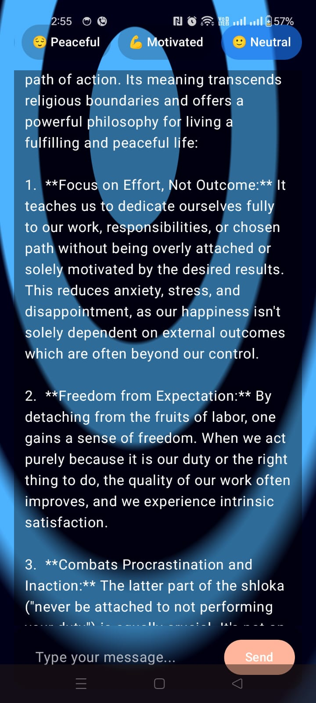
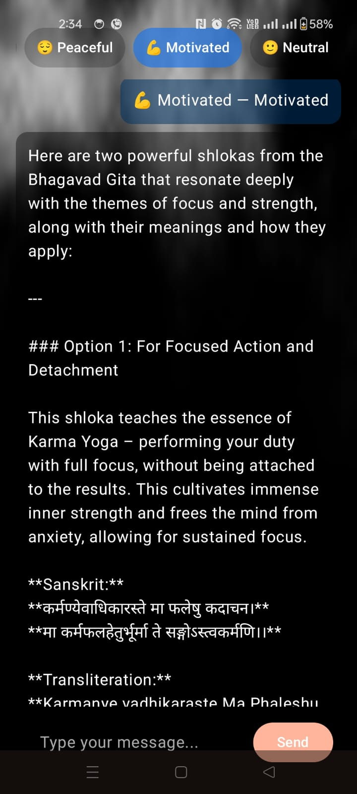
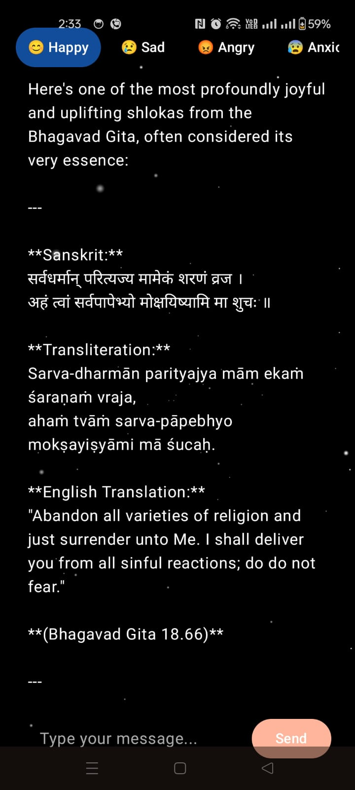

# 🙏 GeetaChat — AI-Powered Bhagavad Gita Companion

> A mood-aware Android chat app powered by **Firebase Gemini AI** that responds with relevant *Bhagavad Gita* shlokas based on how you're feeling.

---

## 📸 Features

- 🤖 **Gemini 2.5 Flash** AI responses via Firebase AI
- 🎭 **Mood-based prompting** — tap a mood chip and receive a relevant Gita verse
- 💬 **Free-text chat** — ask any question and get a spiritually grounded response
- 🎨 **AGSL Shader backgrounds** — live animated backgrounds (Fire, Stars, Rainbow, Smoke, Ripple)
- 🌊 **Tap-to-ripple** — touch the screen to interact with the ripple shader
- 🔄 **Double-tap** to cycle through background modes
- 👆 **Swipe down** to exit
- 🏗️ **Clean MVVM architecture** with Hilt dependency injection

---

## 🏛️ Architecture

This project follows **MVVM (Model-View-ViewModel)** with a Repository pattern.

```
com.aps.geetai/
├── model/
│   ├── ChatMessage.kt          # Data class for chat messages
│   └── Mood.kt                 # Mood enum with emoji + prompt labels
├── repository/
│   ├── ChatRepository.kt       # Interface — abstracts the data source
│   └── ChatRepositoryImpl.kt   # Firebase Gemini AI calls live here
├── di/
│   └── AppModule.kt            # Hilt DI bindings
├── viewmodel/
│   ├── ChatUiState.kt          # Single UI state data class
│   └── ChatViewModel.kt        # Business logic, mood→prompt mapping
├── ui/
│   └── ChatScreen.kt           # Composables — pure UI, zero logic
├── MainActivity.kt             # Thin entry point, wires VM → UI
├── BackgroundMode.kt           # Shader background enum
└── SmartMediaAIApplication.kt  # Hilt + Firebase initialisation
```

### Layer responsibilities

| Layer | File(s) | Rule |
|---|---|---|
| **Model** | `ChatMessage`, `Mood` | Plain Kotlin data — no Android imports |
| **Repository** | `ChatRepository`, `ChatRepositoryImpl` | All Firebase / network calls |
| **ViewModel** | `ChatViewModel`, `ChatUiState` | Business logic; no Firebase, no Compose |
| **View** | `ChatScreen`, `MainActivity` | Render state; communicate via lambdas only |

### Data flow

```
User Action (tap / type)
        │
        ▼
  ChatScreen.kt          ← renders ChatUiState, fires lambda callbacks
        │
        ▼
  ChatViewModel.kt        ← updates ChatUiState, calls repository
        │
        ▼
  ChatRepositoryImpl.kt   ← calls Firebase Gemini API
        │
        ▼
  Firebase Gemini AI      ← returns shloka / response text
        │
        ▼
  ChatUiState updated     ← ViewModel posts new state via StateFlow
        │
        ▼
  ChatScreen re-renders   ← Compose observes and redraws
```

---

## 🛠️ Tech Stack

| Technology | Purpose |
|---|---|
| Kotlin | Primary language |
| Jetpack Compose | Declarative UI |
| AGSL (Android Graphics Shading Language) | Live shader backgrounds (API 33+) |
| Firebase Gemini AI (`gemini-2.5-flash`) | AI response generation |
| Hilt | Dependency injection |
| Kotlin Coroutines + StateFlow | Async operations & reactive state |
| AndroidX ViewModel | Lifecycle-aware state management |

---

## 🚀 Getting Started

### Prerequisites

- Android Studio Hedgehog or later
- Android device / emulator running **API 33 (Android 13)** or higher (required for AGSL shaders)
- A Firebase project with **Vertex AI for Firebase** or **Google AI** enabled

### Setup

**1. Clone the repository**
```bash
git clone https://github.com/AkshaySakare/geetai.git
cd geetai
```

**2. Connect Firebase**
- Go to the [Firebase Console](https://console.firebase.google.com/)
- Create a new project (or use an existing one)
- Add an Android app with package name `com.aps.geetai`
- Download `google-services.json` and place it in the `app/` directory
- Enable **Firebase AI Logic** (Gemini API) in the Firebase console

**3. Build & Run**
```bash
./gradlew assembleDebug
```
Or press **Run ▶** in Android Studio.

---

## 🎭 Moods & Prompts

Each mood chip sends a tailored prompt to Gemini to fetch the most relevant Gita verse:

| Mood | Prompt sent to Gemini |
|---|---|
| 😊 Happy | Share a joyful and uplifting Bhagavad Gita shloka |
| 😢 Sad | Share a comforting verse for someone feeling sad |
| 😡 Angry | Give a shloka that teaches how to control anger |
| 😰 Anxious | Suggest a verse that brings peace |
| 😕 Confused | Share a Gita shloka about decision-making |
| 😌 Peaceful | Give a shloka about peace and spiritual calm |
| 💪 Motivated | Share a powerful shloka to stay focused and strong |

---

## 🎨 Shader Backgrounds

Background animations are rendered using **AGSL shaders** loaded from `res/raw/`:

| Mode | File | Description |
|---|---|---|
| 🔥 Fire | `fire_shader.agsl` | Flickering flame effect |
| 🌌 Star | `star_field.agsl` | Twinkling star field |
| 🌈 Rainbow | `rainbow_shader.agsl` | Flowing colour waves |
| 💨 Smoke | `smoke.agsl` | Drifting smoke particles |
| 🌊 Ripple | `ripple.agsl` | Tap-reactive water ripple |

> **Double-tap** anywhere on screen to cycle to the next background.
> **Tap** to set the ripple origin (Ripple mode only).

---

## 📦 Screenshot

<p align="center">
  
  &nbsp;
  
  &nbsp;
  
   &nbsp;
  
</p>
---

## 🤝 Contributing

1. Fork the repository
2. Create a feature branch: `git checkout -b feature/my-feature`
3. Commit your changes: `git commit -m "Add my feature"`
4. Push to the branch: `git push origin feature/my-feature`
5. Open a Pull Request

---

## 📄 License

```
MIT License

Copyright (c) 2025 GeetaChat

Permission is hereby granted, free of charge, to any person obtaining a copy
of this software and associated documentation files (the "Software"), to deal
in the Software without restriction, including without limitation the rights
to use, copy, modify, merge, publish, distribute, sublicense, and/or sell
copies of the Software, and to permit persons to whom the Software is
furnished to do so, subject to the following conditions:

The above copyright notice and this permission notice shall be included in all
copies or substantial portions of the Software.

THE SOFTWARE IS PROVIDED "AS IS", WITHOUT WARRANTY OF ANY KIND, EXPRESS OR
IMPLIED, INCLUDING BUT NOT LIMITED TO THE WARRANTIES OF MERCHANTABILITY,
FITNESS FOR A PARTICULAR PURPOSE AND NONINFRINGEMENT.
```

---

<div align="center">
  Made with 🙏 and Kotlin
</div>
